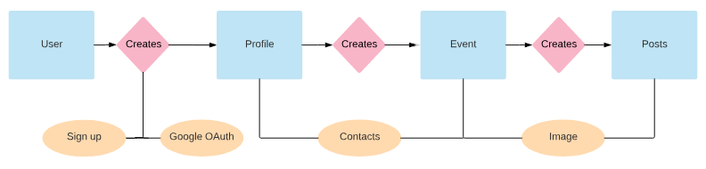

# GroupUp - Backend


[](https://travis-ci.org/groupUp/groupUp)
[](https://github.com/groupUp/groupUp)
[](https://github.com/groupUp/groupUp)


**Author**: Zachary Schumpert, Sarah Geyer, Carl Olson, Mario Flores Jr.

**Version**: 1.0.0

## Overview

The GroupUp application provides users with a common virtual meeting place where they can plan events, update agendas, send messages and keep track of any information a group would enjoy having easy access to. The user signs up for an account and creates a profile to interact in the application. Users can easily invite friends, family or coworkers by accessing their Google contacts directly from the GroupUp application.  Within your custom group, share locations you plan to meet, share photos of an event and message all the members in your group at once. The application is built with a RESTful HTTP server that utilizes basic authentication using Express and Google Oath. Mongoose and MongoDB are used for the Schema and database functionality. GroupUp will make any company event, convention, road-trip or party a breeze to plan.

#### In Your.env File:

 * PORT: defaults to 3000
 * NODE_ENV: set to development
 * MONGODB_URI: set to mongodb://localhost/testing

## Getting Started

To install dependencies, run:

```npm i```

```nodemon``` or ```npm start``` This will start the server and tell you what port you're on

To start the db and test the routes, from the command line, enter:

```npm run dbon``` This turns MongoDB on

```npm run test``` Enter this line in a separate command line tab. This initiates the tests via jest

```npm run dboff``` This turns off MongoDB

## Workflow



## Mechanics

```POST /signup```

- To create an account, the username, email, and password is sent to the server utilizing the POST/signup route. An authenticated token is generated with the password provided. The newly created user account is saved into the database.

```GET /login```

- The user will make a GET request with a required username and a password that is then authenticated to retrieve a token that is used for login.

```POST /profiles```

- Once the user is authenticated, a POST request is made which creates a new profile that is necessary to establish an identity within the app. This new profile is stored into the database for future use.

```GET /profile/events```

- Each profile will have capability to access events associated with the profile.

```GET /profiles/me```

- Returns a requested profile that is associated with a particular account.

```GET /profiles/:id```

- Profiles are retrieved by id from the database to access unique entity.

```PUT /profile```

- Retrieves a profile for the purpose of updating content.

```POST /events```

- Provides the user capability to make a POST request that creates an event that is stored to the database.

```PUT /events/:id```

- Retrieves events by unique id, allowing the user to update events if necessary.

```DELETE /events/:id```

- Accesses events by unique id, allowing the user to delete events if necessary.

```GET /events/public```

- Allows the user access to public events available.

```GET /events/:event_id```

- Events are accessed by unique id from the database.

```POST /posts/image```

- User will have capability to create posts within each event, also allowing the user to include images to each post.

```POST /posts/:events_id```

- Each event will contain posts that will have a unique correlating id that is stored into the database.

```GET /posts/me```

- Returns a requested post that is associated with a particular event.

```PUT /posts/likes/:post_id```

- Each individual post will have capability to be updated within an event by allowing users to accrue "likes" from other users.

```PUT /posts/:post_id```

- Each individual post will have capability  to be updated by the user with access to the unique id within the database.

```DELETE /posts/:post_id```

- Accesses posts associated with event by unique id, allowing the user to delete posts within the event if necessary.

```GET /oauth/google```

- Routes the user to Google Oauth, retrieving the user's login and access token for authentication. This will provide access to the user username, email, profile image, and contacts. 


## Architecture

JavaScript, Node, Express, MongoDB, Mongoose, Travis, Heroku, superagent, winston, multer, http-errors, uuid, logger, jest, babel, dotenv, body-parser, crypto, bcrypt, jsonwebtoken, fs-extra, faker.

## Change Log

 * 6-18-2018 9:30am - Initial scaffolding
 * 6-18-2018 10:15am - Signup and Login functionality established(Post, Get)
 * 6-18-2018 11:30am - Completed Form Validation, Google OAuth functionality, and Bearer Basic Authentication for Login/Signup.
 * 6-18-2018 1:00pm - Account, Event, Post Router tests established.
 * 6-18-2018 3:30pm - Routes established for Profile, Post, and Events(Get, Put, Post, Delete)
 * 6-19-2018 4:45pm - Create "New Event" functionality working (Date, Time/Schedule, Description)
 * 6-19-2018 5:30pm - Delete functionality implemented.
 * 6-20-2018 4:20pm - Created custom cards, Title, File Upload, & List/Description - hyperlinks
 * 6-20-2018 7:54pm - Implemented Public vs. Private Event Functionality.


